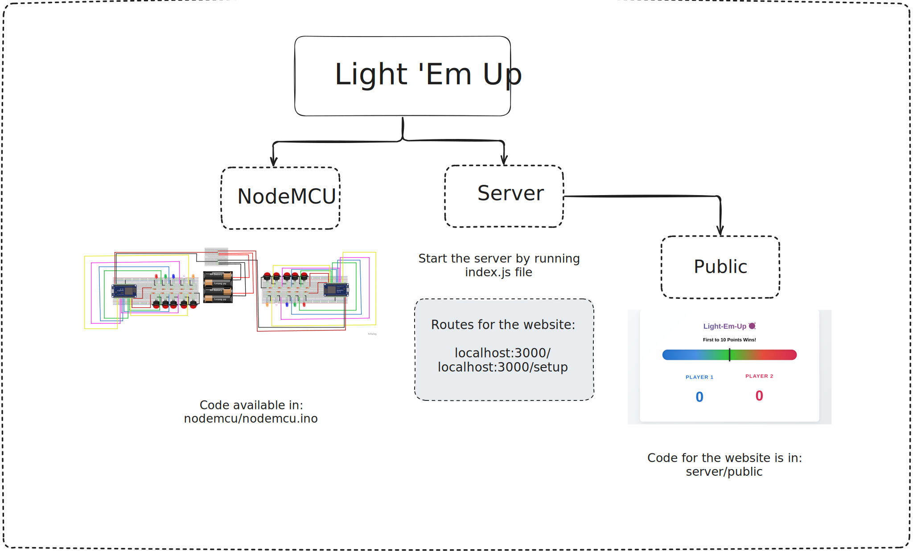

<p align="center">
    
</p>

<div align="center">
    <strong>⚡ Electronic Whack-A-Mole 🔨</strong></br>
    <syb>Made using NodeMCU and Node.js.</sub>
</div>
<br>

<div align="center">
  <a href="LICENSE">
    
  </a>
</div>
<br>

## 🔍 Project Overview


- Circuit design is available in `nodemcu/design` folder (Includes fritzing file)

## 🚧 Setup
Clone the repo
```bash
git clone https://github.com/Ranger-NF/light-em-up.git
```

Setup NodeMCU:
  - Open `nodemcu/nodemcu.ino` in Arduino IDE
  - Enter ntfy.sh topic name in arduino.ino (line number: 283)
    ```String url = "/<ENTER_NTFY_TOPIC_NAME>";```
  - Connect NodeMCU to PC and upload it

Setup Server:
  - Get into `nodemcu/` and install npm packages:
  ```bash
  cd nodemcu
  npm i
  ```

## 🤟🏻 Usage

- Setup WiFi/Hotspot with the following credentials (can be changed in `nodemcu/nodemcu.ino`):
  - **SSID:** light-em-up
  - **Password:** 8096light
- Give power to NodeMCUs via battery pack
- Note down the IP Addresses sent to ntfy.sh
- Enter the following command for starting server:
  ```
  cd server
  node index.js
  ```
- Go to `http://localhost:3000/setup` and enter the IP Addresses we got earlier (eg: http://192.168.1.53/)
- (Optional) Add player name whlist adding IP Address
- You are all ready to play the game!

## 📹 Demo video

https://github.com/user-attachments/assets/4d6eaa78-d242-41ed-b979-c37e4f6964c3
